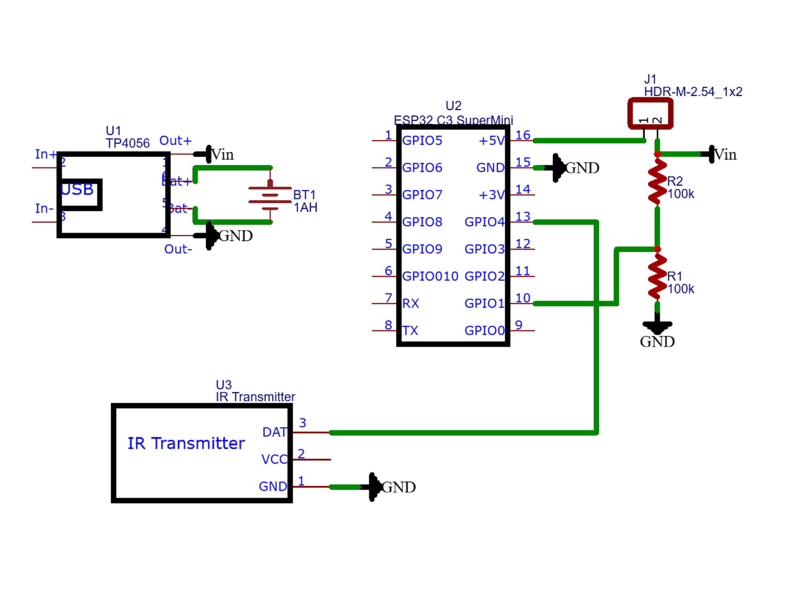

# IR Remote to controls the Electra Minimax AC and its dampers

The ESP microcontroller is responsible for controlling the Electra Minimax AC and its dampers.  
Each ESP device is uniquely identified by its BLE MAC address, which allows the system to precisely locate and control individual devices in a multi-device setup.  
This ensures that commands are sent to the correct ESP device, enabling seamless operation across multiple units.  

Each ESP functions as a BLE peripheral, meaning it advertises its presence and waits for commands from a central controller.  
The central controller, referred to as the BLE master, acts as the remote control for all connected ESP peripherals.  
The BLE master sends commands to the ESP devices, which then translate these commands into IR signals to control the AC and its dampers.
This architecture allows for centralized control of multiple ESP devices, providing a scalable and efficient solution for managing multiple AC units and dampers.nication to control IR devices.

## Developer

Developed by Tamir Mhabary

## Features

- BLE communication to control IR devices.
- Easy integration with mobile or desktop applications.
- Support for multiple IR protocols.

## Folder Structure

```
The project is organized as follows:
BlePerepherial/
├── src/                
│   └── main.cpp         # Main application code
├── lib/                
│   ├── BLEServerManager//
│   │   ├── BLEServerManager.cpp # BLE server management logic
│   │   └── BLEServerManager.h   # BLE server management header             
│   ├── decode_packet/
│   │   └── decode_packet.h      # Packet decoding logic
│   ├── deep_sleep/
│   │   └── deep_sleep.h         # Deep sleep functionalityGetting Started
│   ├── global_vars/
│   │   └── global_var.h         # Global variables
│   └── IR/                      
|       └── ir.h                 # IR-related functionality
└── Readme.md           # Project documentationMini microcontroller.
```

### Prerequisites

- ESP32-C3 Super Mini microcontroller.  
- IR transmitter and receiver modules
- Development environment set up for your ESP32-C3 (e.g., Arduino IDE, PlatformIO).
evelopment environment.

### Installationsh the firmware to your ESP32-C3 Super Mini.

1. Clone this repository:
```bash
   git clone https://github.com/tamirmha/AC-Control.git 
```
2. Open the project in your development environment.
3. Flash the firmware to your ESP32-C3 Super Mini.

### Usage
schematic for the project:
1. Power on the BLE peripheral device.
2. Connect to the device using a BLE-compatible application.g)
3. Send IR commands via the BLE interface.

### Electronic Schematic
re welcome! Please fork the repository and submit a pull request.
Below is the electronic schematic for the project:



## Contributions

Contributions are welcome! Please fork the repository and submit a pull request.

## License

This project is licensed under the MIT License. See the LICENSE file for details.
